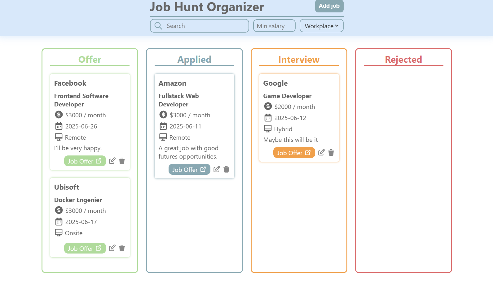

# 🗃️ Job Hunt Organizer

A modern **job tracking application** that helps you organize your job search process using a clean and interactive **Kanban board**. You can add jobs, group them by status (Offer, Applied, Interview, Rejected), and move them between columns with **drag & drop**. All data is saved locally using `localStorage`, so nothing is lost between sessions.

📸 Screenshots



## 🚀 Features

- Add, edit, and delete job entries.
- Orginize jobs by status: `Offer`, `Applied`, `Interview` and `Rejected`.
- Fully interactive **Kanban-style board**.
- Native **Drag & Drop API**;
- Real-time search and filtering.
- Persistent data with `localStorage`.

## 🧱 Tech Stack

- **React** + **Vite**
- **CSS Modules**
- **TypeScript**

## Setup

Clone the repository and install dependencies:

```bash
git clone https://github.com/josevigodev/job-hunting-organizer.git
cd job-hunting-organizer
npm install
```

Run de app localy:

```bash
npm run dev
```

Build for production:

```bash
npm run build
```

Preview the production build:

```bash
npm run preview
```

## ✅ End-to-End Testing (Cypress)

This project includes end-to-end tests using _Cypress_ to validate the core user journey.

### 🔍 Tested User Flow

- Add a new job using the form
- Edit the job details
- Drag and drop the job to another status column

These tests ensure that the main job management interactions are working correctly from a real user’s perspective.

### 🧪 Tech Stack

- Cypress
- TypeScript
- [@4tw/cypress-drag-drop](https://www.npmjs.com/package/@4tw/cypress-drag-drop) – used to simulate drag and drop events in tests

### 🚀 Run Tests

To open the Cypress test runner:

```bash
npx cypress open
```

To run the tests in headless mode:

```bash
npx cypress run
```
